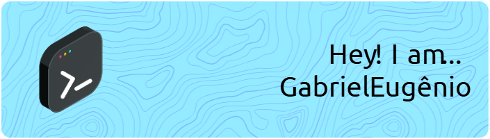

-----

<div>

</div>

-----

**Eu me chamo Gabriel** :wave:
```
Tenho afinidade em informática/ t.i e inglês. Trabalho muito bem em equipe, sob pressão,
amo desafios e poder superá-los, aprendo com muita facilidade e mesmo em aprendizado já
consigo aplicar o conhecimento recém obtido nos trabalhos demandados. Sou formado em Técnico
de informática pelo IFSEMG - RP e atualmente estou cursando Sistemas de Informação na Newton
Paiva BH. Sou fluente em inglês e estou aprendendo japonês, tenho curso em liderança, robótica
e robótica com física aplicada.

Entrando no domínio de programação, durante o Técnico realizei projetos com Python para
criação de softwares e domínio de redes; criei sites, como uma loja virtual em PHP com MySQL/MySQLi
e Javascript programado manualmente e posteriormente utilizando o WordPress; criei softwares em Java
utilizando o Swing e o FX; atualmente estou utilizando C mais profundamente, antes tinha apenas um
conhecimento básico em C para programação de Arduinos.
```

<div>
<p align="left">  </p>
</div>

-----

</br>
</br>
</br>

<p align="left">
<a href="https://linkedin.com/in/gab-eugenio" target="blank"></a>
<a href="https://discord.gg/deweedg" target="blank"></a>
</p>

</br>
</br>
</br>

-----
</br>
</br>
<p align="left"> 
<a href="https://developer.android.com" target="_blank" rel="noreferrer">  </a> 
<a href="https://www.arduino.cc/" target="_blank" rel="noreferrer">  </a> 
<a href="https://aws.amazon.com" target="_blank" rel="noreferrer">  </a> 
<a href="https://azure.microsoft.com/en-in/" target="_blank" rel="noreferrer">  </a> 
<a href="https://www.blender.org/" target="_blank" rel="noreferrer">  </a> 
<a href="https://www.cprogramming.com/" target="_blank" rel="noreferrer">  </a> 
<a href="https://www.w3schools.com/cpp/" target="_blank" rel="noreferrer">  </a> 
<a href="https://www.w3schools.com/cs/" target="_blank" rel="noreferrer">  </a> 
<a href="https://www.w3schools.com/css/" target="_blank" rel="noreferrer">  </a> 
<a href="https://www.djangoproject.com/" target="_blank" rel="noreferrer">  </a> 
<a href="https://dotnet.microsoft.com/" target="_blank" rel="noreferrer">  </a> 
<a href="https://www.figma.com/" target="_blank" rel="noreferrer">  </a> 
<a href="https://flutter.dev" target="_blank" rel="noreferrer">  </a> 
<a href="https://git-scm.com/" target="_blank" rel="noreferrer">  </a> 
<a href="https://www.adobe.com/in/products/illustrator.html" target="_blank" rel="noreferrer">  </a> 
<a href="https://www.java.com" target="_blank" rel="noreferrer">  </a> 
<a href="https://developer.mozilla.org/en-US/docs/Web/JavaScript" target="_blank" rel="noreferrer">  </a> 
<a href="https://www.elastic.co/kibana" target="_blank" rel="noreferrer">  </a> 
<a href="https://kubernetes.io" target="_blank" rel="noreferrer">  </a> <a href="https://www.linux.org/" target="_blank" rel="noreferrer">  </a> 
<a href="https://www.mongodb.com/" target="_blank" rel="noreferrer">  </a> 
<a href="https://www.mysql.com/" target="_blank" rel="noreferrer">  </a> <a href="https://www.oracle.com/" target="_blank" rel="noreferrer">  </a>  
<a href="https://www.php.net" target="_blank" rel="noreferrer">  </a> 
<a href="https://www.postgresql.org" target="_blank" rel="noreferrer">  </a> 
<a href="https://www.python.org" target="_blank" rel="noreferrer">  </a> 
<a href="https://www.sqlite.org/" target="_blank" rel="noreferrer">  </a> 
<a href="https://unity.com/" target="_blank" rel="noreferrer">  </a>  
</p>
</br>
</br>

-----

<table>
<tr>
 <td align="center" colspan="3"></td>
</tr> 
<tr>
<td>

</td>
<td>

</td>
<td>

</td>
</tr>
<tr>
<td>

</td>
<td>

</td>
<td>

</td>
</tr>
<tr>
 <td align="center" colspan="3"></td>
</tr>
</table>
</details>
</div>

-----
</br>
</br>
</br>
</br>


</br>
</br>
</br>
</br>

-----

                                                                           
                                                                           
